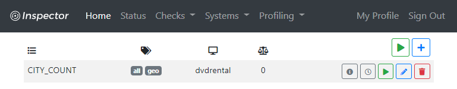
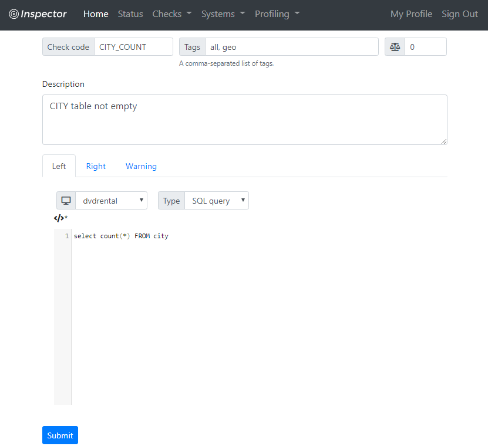
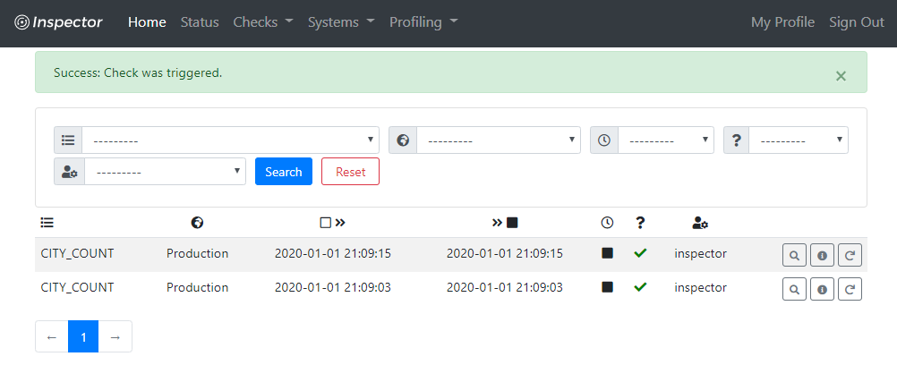

Inspector
=========

.. image:: https://img.shields.io/badge/built%20with-Cookiecutter%20Django-ff69b4.svg
     :target: https://github.com/pydanny/cookiecutter-django/
     :alt: Built with Cookiecutter Django

.. image:: http://img.shields.io/:license-Apache%202-blue.svg
     :target: http://www.apache.org/licenses/LICENSE-2.0.txt
     :alt: License

Born out of the experience that ETL pipelines never get enough testing,
Inspector was built to help with:

* managing and execution of check queries when testing ETL processes
* periodic data integrity verification in production environments
* confirming that testing has actually been done ;)
* data profiling

Documentation
-------------

https://data-inspector.readthedocs.io/

Using docker images
-------------------

Local development, only Postgres and Redis in Docker
~~~~~~~~~~~~~~~~~~~~~~~~~~~~~~~~~~~~~~~~~~~~~~~~~~~~

.. code-block:: bash

    source .envs/local.env
    docker-compose -f docker-compose-db.yml up -d
    ./manage.py runserver

Docker development
~~~~~~~~~~~~~~~~~~~~~~~~~~~~~~~~~~~~~~~~~~~~~~~~~~~~

.. code-block:: bash

    docker-compose -f docker-compose-develop.yml up -d

Access Inspector at :code:`http://localhost:8000`

Docker-compose - production image
~~~~~~~~~~~~~~~~~~~~~~~~~~~~~~~~~~~~~~~~~~~~~~~~~~~~

Simply

.. code-block:: bash

    docker-compose up -d

and Inspector will be available at :code:`http://localhost:5000`

Obviously, you might want to customize parameters,
so check out the files in :code:`.envs/example` and prepare your own
:code:`docker-compose.yml` with HTTPS reverse proxy in front

User interface
--------------

* **Check list**

* **Check definition**

* **Check execution history**

Contributing
--------------

You are more than welcome to submit a PR
