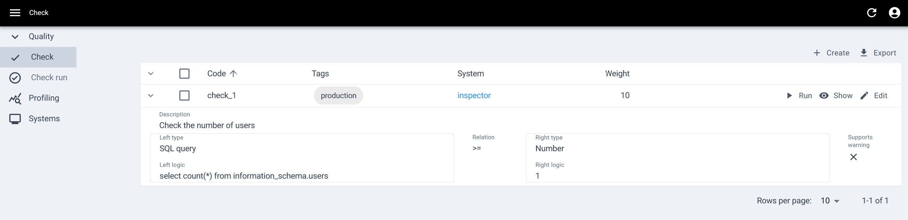
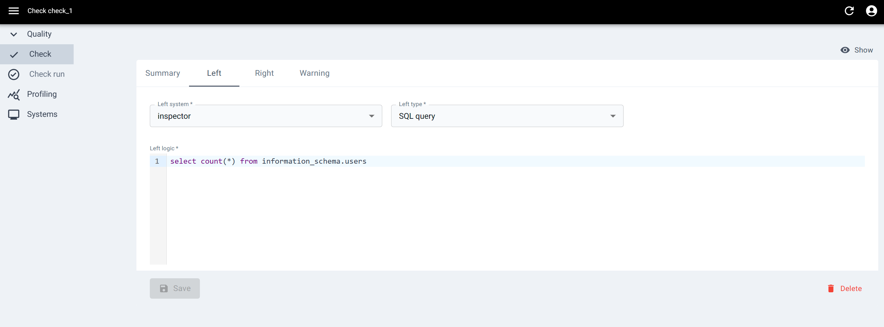
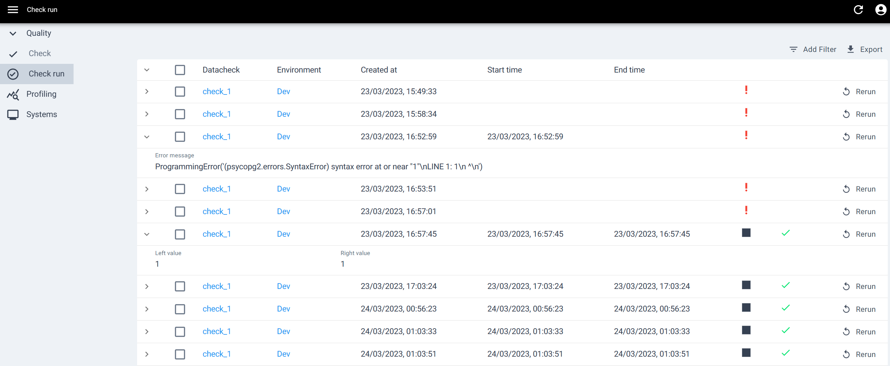
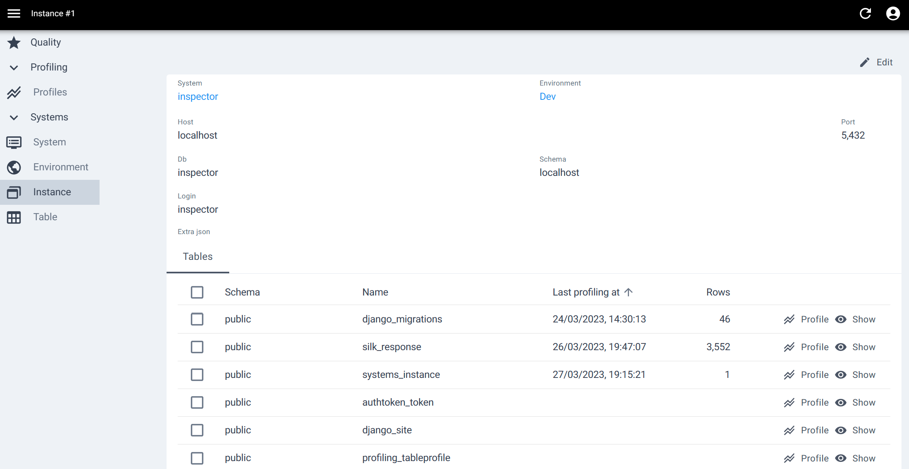
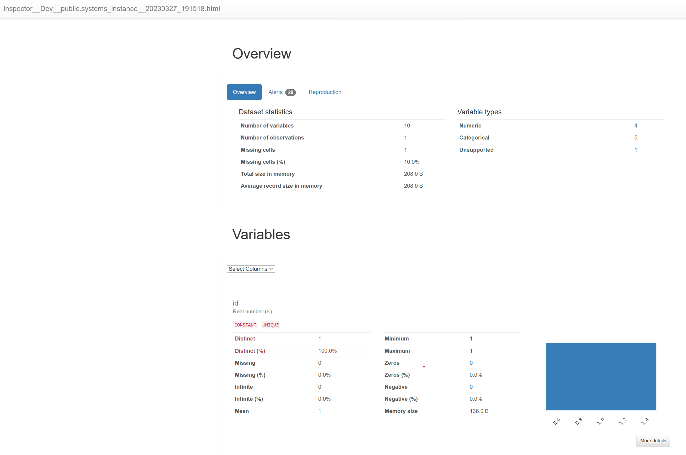

Inspector
=========

.. image:: http://img.shields.io/:license-Apache%202-blue.svg
     :target: http://www.apache.org/licenses/LICENSE-2.0.txt
     :alt: License

Inspector was created because ETL pipelines never get enough testing.

The main features are:

* **Checks** - run SQL queries within your database or across two databases
    * supports for any SqlAlchemy compatible database
    * comparing results against:
        * another SQL query
        * constant values (dates, numbers, strings)
        * Python and SQL expressions
* **Check history** - see how your checks behaved in the past
* **Multiple environments** - run checks against different
  instances of the same system
* **Tagging** - tag checks to easily group them and execute multiple checks
  at once
* **Profiling** - rapid profiling of database tables using `ydata-profiling`

You can use Inspector for:
* monitoring correctness of data in production
* automated testing of ETL processes
* confirming that testing has actually been done ;)
* profiling your data

Some key technical details:
* Built with Django
* Uses Celery for asynchronous tasks
* All functionality is exposed via REST API (Django REST Framework)
* Fully dockerized
* SqlAlchemy for database connections
* `ydata-profiling` for profiling
* React frontend - available separately, non-open source,
  contact the author for more details

Documentation
-------------

https://data-inspector.readthedocs.io/

Using docker images
-------------------

Local development, only Postgres and Redis in Docker
~~~~~~~~~~~~~~~~~~~~~~~~~~~~~~~~~~~~~~~~~~~~~~~~~~~~

Install local dependencies for all services

.. code-block:: bash

    pip install -r requirements/local.txt

Run a local django server

.. code-block:: bash

    export DJANGO_READ_DOT_ENV_FILE=True
    export DJANGO_ENV_FILE=.envs/.local/.inspector
    docker-compose -f docker-compose-develop.yml up -d postgres redis
    ./manage.py runserver

.. code-block:: bash

You may also use

.. code-block:: bash
   ./manage.py runserver_plus

Docker development
~~~~~~~~~~~~~~~~~~~~~~~~~~~~~~~~~~~~~~~~~~~~~~~~~~~~

.. code-block:: bash

    docker-compose -f docker-compose-develop.yml up -d

Access Inspector at :code:`http://localhost:8000`

Docker-compose - production image
~~~~~~~~~~~~~~~~~~~~~~~~~~~~~~~~~~~~~~~~~~~~~~~~~~~~

Simply

.. code-block:: bash

    docker-compose up -d

and Inspector will be available at :code:`http://localhost:5000`

Obviously, you might want to customize parameters,
so check out the files in :code:`.envs/example` and prepare your own
:code:`docker-compose.yml` with HTTPS reverse proxy in front

User interface
--------------

* **Check list**

* **Check definition**

* **Check execution history**

* **Table list**

* **Profiling history**

.. image:: docs/_static/profiling_history.png

* **Profiling report (Pandas Profiling)**

Contributing
--------------

You are more than welcome to submit a PR
